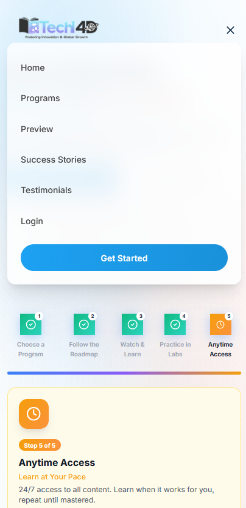
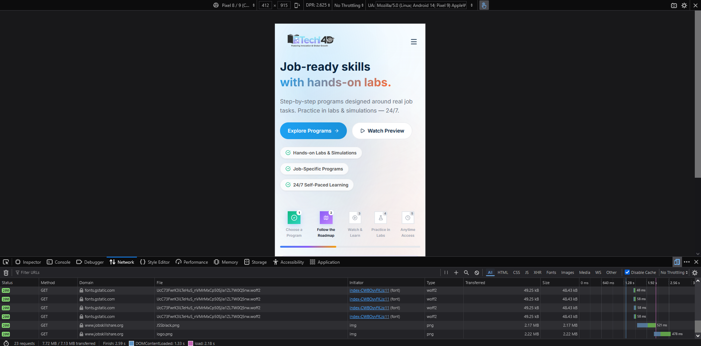

# Week 1 Comprehensive Site Audit & Weekly Report
**Date:** July 10, 2026  
**Auditor:** Faizian Ahmed Yousuf  
**Track:** Web Development & UI/UX Internship

---

## 🗺️ Monday's Deliverable: JSS Architecture Map

- Homepage (jobskillshare.org)
  ├── Hero Section (Value Prop, Primary CTAs: "Explore Programs", "Watch Preview")
  ├── Step-by-Step Training Roadmap ("How It Works" 1-5 workflow)
  ├── Program/Course Catalog Matrix
  │   ├── Modern IT Support Certificate Program (Entry-Level)
  │   ├── Systems Engineer Certificate Program (Advanced)
  │   ├── Cloud Engineer Certificate Program (Advanced)
  │   ├── Cybersecurity Analyst Certificate Program (Advanced)
  │   ├── AI Engineering & Automation Certificate Program (Advanced)
  │   └── Freelancer Certificate Program (Basic-to-Advanced)
  ├── Video Preview & Learning Delivery Showcase (Lecture + Lab Demos)
  ├── Membership Tiers & Access Gates
  │   ├── Individual Premium Membership
  │   └── B2B / Institutional Bulk Licensing
  └── Global Footer (Programs Links, Discord Community, Legal Policies)

---

## 📱 Tuesday's Deliverable: JSS Homepage UX Audit
**Viewport:** Mobile (Emulated Pixel 8/9 Chrome Android 14)

### Issue 1: Above-the-Fold Visual Clutter & Value Proposition
* **Analysis Area:** 5-Second Clarity & Hero Section
* **Screenshot:** 
* **Problem Description:** The primary hero headline is surrounded by multiple lines of secondary descriptive text on small mobile displays. This layout creates visual noise that competes for the user's attention and delays clear understanding of the site's primary purpose.
* **Recommended Fix:** Consolidate the text elements above the fold. Use a single bold value proposition headline paired with immediate action buttons to keep the initial viewport clear and direct.

### Issue 2: Mobile Navigation Menu Density
* **Analysis Area:** Navigation Clarity & Responsiveness
* **Screenshot:** 
* **Problem Description:** When opening the hamburger menu, users face a long list of specific certification tracks. Scrolling through this extensive menu on a mobile screen causes layout friction and makes it difficult to find top-level categories.
* **Recommended Fix:** Replace the flat text list with an interactive accordion menu structure. Hide specific training paths until a user explicitly expands a main category header.

### Issue 3: Heavy Asset Payload & Missing Optimization
* **Analysis Area:** Performance Optimization (Network Tab)
* **Screenshot:** 
* **Problem Description:** While the page successfully finishes initialization in 2.18 seconds, the overall transferred payload size is a massive 7.13 MB. DevTools reveals that two core theme assets (`JSSBlack.png` at 2.17 MB and `logo.png` at 2.22 MB) are being served completely uncompressed to mobile viewports.
* **Recommended Fix:** Compress these images and convert them to modern web formats like `.webp` or `.avif`. This architectural switch will drop the asset sizes from megabytes down to kilobytes, significantly cutting data usage for mobile users.

---

## 🎓 Wednesday's Deliverable: Program & Catalog Pages UX Audit

### Issue 1: Course Catalog Filter Visual Hierarchy
* **Analysis Area:** Catalog Layout & Navigation Clarity
* **Screenshot:** 
* **Problem Description:** The mobile catalog displays certification paths vertically with large cards. While information density is good, there is a lack of quick-filtering options (e.g., filtering by "Entry-Level" vs "Advanced") at the top of the mobile viewport, forcing users to scroll past irrelevant programs to find their track.
* **Recommended Fix:** Implement a sticky horizontal pill-filter component at the top of the mobile catalog page (`flex-direction: row; overflow-x: auto;`) allowing instant filtering by career tier.

### Issue 2: Deep-Dive Program Page Content Density
* **Analysis Area:** Content Completeness & Program Descriptions
* **Screenshot:** 
* **Problem Description:** The individual program page provides excellent technical depth (e.g., hours of training, explicit topics like Linux/Security+). However, on mobile viewports, the text block describing the target audience is highly dense, making it difficult for a user to scan quickly.
* **Recommended Fix:** Refactor long text paragraphs into high-contrast bulleted layout grids or icon-driven callouts to improve mobile readability.

### Issue 3: Enrollment Flow Multi-Step Friction
* **Analysis Area:** Enrollment Flow & Primary CTAs
* **Problem Description:** Clicking "Start Learning" or "Open Program" initiates an enrollment loop that routes users through multi-tier membership selection rather than a direct, single-click enrollment path for that specific certification track.
* **Recommended Fix:** Implement a direct checkout/enrollment modal or bypass route that binds the specific course selection directly to the registration payload.

---

## 🔒 Thursday's Deliverable: Membership & Registration UX Audit

### Issue 1: Registration Form Input Overhead
* **Analysis Area:** Sign-up Flow Friction Points
* **Screenshot:** 
* **Problem Description:** The initial registration sequence requires multiple manual text inputs on mobile viewports. High form-field counts on mobile devices drastically lower conversion rates due to typing friction.
* **Recommended Fix:** Implement OAuth2 Single Sign-On (SSO) integrations (Google, GitHub, LinkedIn) at the top of the form to reduce registration friction to a single tap.

### Issue 2: Absence of Immediate Trust Signals on Checkout Viewports
* **Analysis Area:** Security Verification & Trust Signals
* **Problem Description:** The mobile membership tiers page displays financial commitments clearly, but lacks immediate, localized trust verification graphics (e.g., secure checkout badges, explicit money-back guarantees, or real-time student satisfaction metrics) directly adjacent to the payment CTA.
* **Recommended Fix:** Append explicit micro-copy trust signals directly below the main checkout buttons (e.g., "🔒 SSL Secured & Encrypted | 30-Day Refund Policy").

---

## 📊 Friday's Deliverable: Top 10 Prioritized Engineering Backlog

This comprehensive index compiles actionable improvement opportunities identified during the Week 1 site audits of jobskillshare.org, prioritized by engineering impact and user acquisition value.

| Priority | System Element | Core Issue Identification | Recommended Fix Strategy | Impact Tier |
| :--- | :--- | :--- | :--- | :--- |
| **1** | Performance | Uncompressed raw asset payload (7.13MB total transfer) | Batch compress and migrate core PNG/JPG assets to `.webp` format. | **Critical** (Speed/SEO) |
| **2** | Registration | Manual form-fill overhead on mobile viewports | Deploy OAuth2 protocols for single-tap Google/GitHub registration. | **High** (Conversion) |
| **3** | Navigation | Text-heavy mobile hamburger menu layout | Refactor navigation layout into nested accordion interface panels. | **High** (UX Friction) |
| **4** | Trust | Missing security validation assets near checkout CTAs | Append secure transaction micro-copy directly below conversion paths. | **Medium** (Trust Dropoff) |
| **5** | Catalog | Lack of instant categorical sorting mechanics on mobile | Introduce a sticky horizontal filtering layout ribbon for career paths. | **Medium** (Discovery) |
| **6** | Hero Space | Above-the-fold content crowding on narrow displays | Prune secondary taglines to highlight a singular, clean core value proposition. | **Medium** (Clarity) |
| **7** | Accessibility | Small tap target sizes for "Open Program" text links | Increase button and text link bounds to a minimum of 48x48px for mobile screens. | **Medium** (UX Polish) |
| **8** | Interaction | Footer element layout density scales poorly on mobile layout | Group extensive footer links into collapsible drop-menus to lower scroll depth. | **Low** (Layout Polish) |
| **9** | Course Pages | Long prose blocks describing program scope | Break dense paragraphs into visual check-lists and icon feature grids. | **Low** (Readability) |
| **10** | Interaction | "Start Learning" loops directly into tier selectors | Configure parameter passing to bind chosen course targets directly to checkout. | **Low** (Flow Polish) |