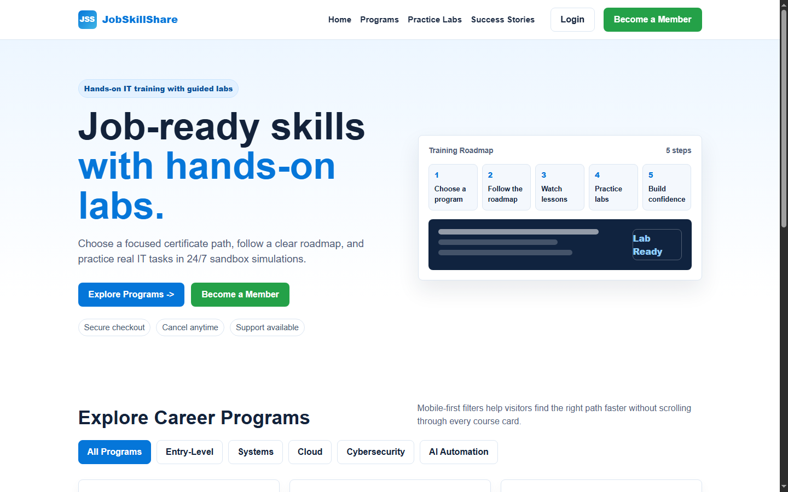
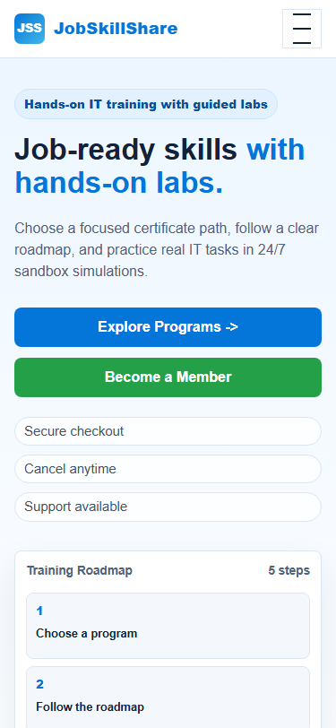
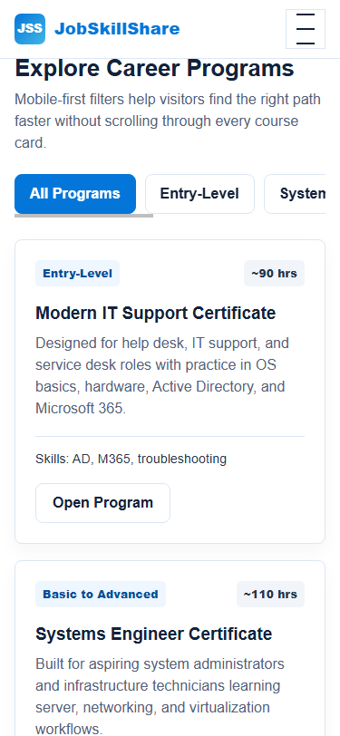

# JobSkillShare Week 2 Homepage Prototype Report

**Intern:** Faizian Ahmed Yousuf
**Internship Track:** Web Development and UI/UX
**Prototype:** Improved JobSkillShare homepage
**Reporting Week:** Week 2, July 13 - July 17, 2026
**Submission Date:** July 18, 2026

---

## 1. Weekly Task Summary

Week 2 focused on turning the Week 1 UX audit findings into a practical homepage improvement prototype. The work started with a mobile-first wireframe plan, then moved into HTML/CSS implementation, responsive testing, visual hierarchy refinement, and final documentation.

| Day | Assigned Task | Output Completed |
| --- | --- | --- |
| Monday | Wireframe proposed homepage improvements for the hero section, navigation restructure, and primary CTA placement. | Mobile-first wireframe notes were prepared and used as the layout plan for the prototype. |
| Tuesday | Build the improved homepage prototype in HTML and CSS based on Week 1 audit findings. | A responsive homepage prototype was created in `index.html`. |
| Wednesday | Implement responsive adjustments for mobile and tablet breakpoints and test in Chrome mobile emulator. | Mobile, tablet, and desktop responsive rules were added and checked. |
| Thursday | Fix spacing or overflow issues found during mobile testing and refine CTA buttons and visual hierarchy. | Mobile overflow was fixed, CTA hierarchy was improved, and touch targets were standardized. |
| Friday | Submit a prototype with a brief document explaining each change, reasoning, and source files. | Final prototype, screenshots, source files, and this Week 2 report were compiled. |

---

## 2. Prototype Source Files

| File | Purpose |
| --- | --- |
| `index.html` | Main responsive homepage prototype built with HTML and CSS. |
| `WEEK2_REPORT.md` | Editable Markdown version of this report. |
| `WEEK2_REPORT.html` | Styled source used to export the final PDF report. |
| `WEEK2_REPORT.pdf` | Formatted PDF report for submission. |
| `assets/desktop-hero.png` | Desktop screenshot of the improved homepage hero and catalog entry. |
| `assets/mobile-hero.png` | Mobile screenshot of the improved hero, CTA placement, and trust signals. |
| `assets/mobile-filters.png` | Mobile screenshot of the program filters and course cards. |

GitHub repository: https://github.com/syfr512/jss-web-dev-internship

---

## 3. Monday Wireframe Plan

The wireframe was planned mobile-first at approximately 375px width, following the supervisor's guidance. The purpose was to decide layout and content order before applying final styling.

```text
Mobile Homepage Wireframe
|-- Header
|   |-- Logo
|   |-- Menu button
|-- Hero
|   |-- Short value statement
|   |-- Headline
|   |-- Supporting text
|   |-- Primary CTA: Explore Programs
|   |-- Secondary CTA: Become a Member
|   |-- Trust signals
|-- Training roadmap preview
|-- Program highlights
|   |-- Horizontal filters
|   |-- Program cards
|-- Confidence / trust section
|-- Final enrollment CTA
|-- Footer
```

### Wireframe Decisions

- Keep the first screen focused on one strong headline and two clear actions.
- Place "Explore Programs" first for new visitors and "Become a Member" second for high-intent visitors.
- Move trust signals near the CTA buttons so users see reassurance before registration.
- Use horizontal filters above program cards to reduce mobile scrolling.
- Keep the navigation simple on mobile with a menu button and grouped links.

---

## 4. Tuesday Prototype Build

The homepage prototype was built in `index.html` using semantic HTML and CSS. It was based on the Week 1 audit priorities: clearer CTA placement, better mobile scanning, program filtering, visible trust signals, and responsive spacing.

### Implemented Sections

- Sticky header navigation
- Mobile menu button
- Improved hero section
- Primary and secondary CTA buttons
- Trust microcopy near CTAs
- Training roadmap preview
- Program catalog filters
- Program cards with level and duration tags
- Confidence/trust section before final CTA
- Footer

### Desktop Prototype Screenshot



---

## 5. Wednesday Responsive Testing

The prototype was tested across desktop and mobile viewport sizes. The mobile target was checked at 375px width to match the mobile-first wireframe requirement.

### Responsive Improvements

- The desktop layout uses a two-column hero with text on the left and a roadmap preview on the right.
- Mobile layout stacks content into one column.
- CTA buttons become full-width on mobile for easier tapping.
- Program filters use horizontal scrolling on mobile.
- Program cards collapse from a three-column desktop grid into a single-column mobile layout.
- Minimum button height was kept at 44px for better mobile touch targets.

### Mobile Hero Screenshot



---

## 6. Thursday Refinement and Fixes

During mobile testing, the main risk was horizontal overflow from long headline text, CTA widths, and responsive containers. The prototype was refined so the page stayed within the mobile viewport.

### Fixes Completed

- Added strict mobile max-width and overflow rules.
- Reduced mobile headline size to avoid clipping.
- Improved CTA button stacking and spacing.
- Made the mobile navigation button visible and easy to tap.
- Added responsive wrapping for trust signals and copy text.
- Verified that the emulated 375px mobile viewport had no horizontal overflow.

Testing result: the final mobile emulation reported `scrollWidth: 375` and `clientWidth: 375`, confirming that the page no longer overflowed horizontally.

### Mobile Filters Screenshot



---

## 7. Explanation of Changes and Reasoning

| Change Made | Reasoning |
| --- | --- |
| Added a direct "Become a Member" CTA in the hero. | Week 1 audit found that ready-to-join users needed a clearer membership path above the fold. |
| Kept "Explore Programs" as the primary CTA. | New visitors usually need to understand available learning paths before registering. |
| Added trust signals near hero CTAs. | Secure checkout, cancellation, and support messages reduce hesitation before sign-up. |
| Reworked navigation into simple top-level links. | Clearer navigation helps users find programs, labs, and success stories faster. |
| Added a mobile menu button. | Mobile users need a compact navigation pattern that does not crowd the header. |
| Added horizontal program filters. | Filters reduce scrolling and make program discovery faster on small screens. |
| Added structured program cards. | Cards make level, duration, skills, and next action easier to scan. |
| Added a roadmap preview. | The roadmap visually explains the learning process before users scroll deeper. |
| Added confidence section before final CTA. | Trust information supports the enrollment decision before registration. |
| Fixed mobile overflow and spacing issues. | This directly responds to the responsive testing and Thursday refinement task. |

---

## 8. Final Prototype Review

The Week 2 prototype successfully converts the Week 1 audit findings into a working homepage improvement. It focuses on clearer first-screen messaging, stronger CTA hierarchy, smoother program discovery, visible trust signals, and mobile-first responsiveness.

The prototype is not meant to replace the production website directly. It is a visual and functional model that can be used in meetings to explain proposed improvements and support the next stage of UI/UX design work.

---

## 9. Submission Checklist

- Homepage improvement wireframe plan included.
- Improved homepage prototype created in HTML/CSS.
- Mobile and desktop responsive behavior implemented.
- Mobile spacing and overflow issues checked and fixed.
- CTA buttons and visual hierarchy refined.
- Screenshots attached as evidence.
- Source files referenced in the report.
- PDF report prepared for submission.

