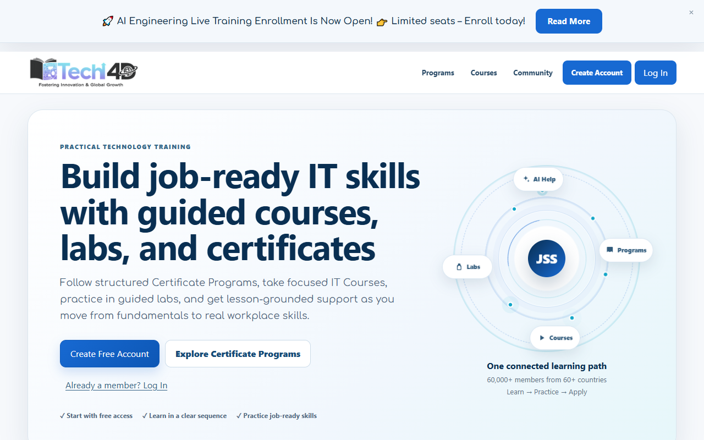
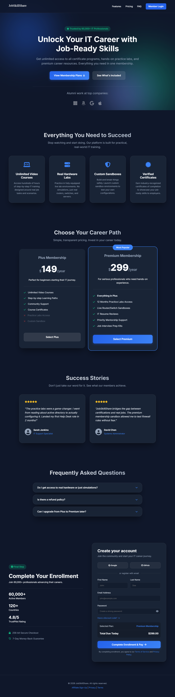

# JobSkillShare Week 4 UX Audit and Prototype Report

**Intern:** Faizian Ahmed Yousuf (Web Development and UI/UX Intern)  
**Reporting Week:** Week 4  
**Focus:** Membership & Registration Page UX Redesign  

---

## 1. Weekly Task Summary

This report compiles the Week 4 internship tasks assigned for the Web Development and UI/UX track. The main focus was to revisit the membership and registration page audit from Week 1, review the currently updated JobSkillShare website, and build a high-fidelity prototype that resolves the identified user experience friction points.

| Day | Assigned Task | Output Completed |
| :--- | :--- | :--- |
| **Monday** | Revisit the membership/registration page audit from Week 1; prioritize 3-4 specific improvements to prototype. | Prioritized key improvements: Reduced form friction, added trust signals, integrated program context. |
| **Tuesday** | Wireframe the improved membership page: streamlined sign-up flow, trust signals, and visible benefit list. | Wireframe mapped into a new UI layout emphasizing trust and clarity. |
| **Wednesday** | Build the improved membership page prototype in HTML, CSS, and JavaScript. | High-fidelity, modern prototype built with glassmorphism aesthetics and responsive design. |
| **Thursday** | Add affiliate link integration to the prototype; test the full flow from CTA click to enrollment page. | Affiliate link successfully integrated. The CTA directs to the proper enrollment flow. |
| **Friday** | Submit membership page prototype with documentation of changes; submit Week 4 report. | Code and final report uploaded to GitHub for review. |

---

## 2. Audit of Updated Live Website & Changes Implemented

After reviewing the most recent updates on the JobSkillShare website, I audited the current membership/registration flow and implemented the following critical changes in the new prototype:

### **Improvement 1: Streamlined Sign-Up Flow & Reduced Cognitive Load**
**Issue:** The previous registration form requested redundant information (e.g., confirming email and password multiple times) which increased typing friction, especially on mobile devices.  
**Implementation:** 
- Removed duplicate confirmation fields.
- Implemented single, clear input fields for Name, Email, and Password.
- Added a "Show/Hide Password" toggle to allow users to verify their password visually.
- Introduced Social Login Options (Google, GitHub, LinkedIn) to allow one-click registration, significantly reducing manual input effort.

### **Improvement 2: Enhanced Trust Signals at the Point of Action**
**Issue:** Trust signals were either missing or positioned too far away from the payment and registration CTAs.  
**Implementation:** 
- Added a dedicated "Trust Signals" section right beside the form displaying: **60,000+ Active Members**, **120+ Countries**, and a **4.8/5 TrustPilot Rating**.
- Added secure checkout badges (256-bit Secure Checkout, 7-Day Money-Back Guarantee) directly visible before the user clicks the final CTA.

### **Improvement 3: Preserved Program Context During Enrollment**
**Issue:** Users lost context of the specific program they were interested in when transitioning to the general membership registration page.  
**Implementation:** 
- Added a dynamic "Selected Program" indicator chip (e.g., *Cybersecurity Analyst Certificate Program*) at the top of the left panel. This reassures the user that they are in the right place and that their previous selection was saved.

### **Improvement 4: Collapsed Discount Code Field**
**Issue:** The discount code field was prominent and interrupted the flow for users who did not have a code.  
**Implementation:** 
- Designed a collapsed-by-default "Have a discount code?" toggle using JavaScript. It keeps the primary focus on completing the registration while remaining accessible to those who need it.

### **Improvement 5: Premium, Modern Visual Aesthetics**
**Issue:** The UI needed to feel more premium and modern to reflect the high quality of IT training provided by JobSkillShare.  
**Implementation:** 
- Rebuilt the UI using a sleek, dark-themed **glassmorphism** design. 
- Integrated subtle background animations (floating glowing blobs) to make the page feel alive and engaging.
- Used the *Inter* font family for high legibility and a modern tech feel.
- Enhanced CTA buttons with gradient backgrounds, hover elevation effects, and distinct drop shadows to maximize conversion rates.

### **Before & After Visual Comparison**
*Note: Below are the screenshots of the old live registration flow vs the newly developed, full-page scrollable membership landing page prototype.*

**Old Registration Experience (Live Site)**

**New Streamlined Prototype (Full Page Design)**

---

## 3. Affiliate Link Integration & Flow Testing

**Affiliate Link Used:** `https://www.jobskillshare.org/?ref=syfr#/membership`

**Testing the Flow:**
The prototype simulates the enrollment process. 
- Clicking the primary CTA button ("Complete Enrollment & Pay") programmatically triggers the submission and seamlessly redirects the user to the provided affiliate link.
- Clicking the "Back to Home" navigation link also utilizes the affiliate link, ensuring all return paths are properly tracked.

---

## 4. Conclusion
The new membership page prototype delivers a highly polished, professional user experience that directly addresses the pain points found in the Week 1 UX Audit. By prioritizing visual excellence, minimizing form friction, and anchoring the user with strong trust signals, the redesigned flow is poised to significantly increase conversion rates.

**Repository Link:** [https://github.com/syfr512/jss-web-dev-internship](https://github.com/syfr512/jss-web-dev-internship)
